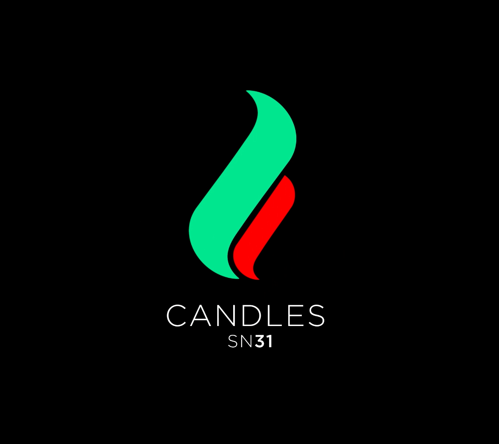

<div align="center">
  
</div>

# Candles Subnet

A decentralized cryptocurrency candle prediction network built on Bittensor. Miners compete to predict cryptocurrency price movements (candle colors and values), while validators score predictions against real market data.

## 🚀 Testnet Launch Phase

**⚠️ This is our testnet launch phase. More features, documentation, and improvements are coming soon!**

This subnet is currently deployed on Bittensor's testnet (netuid 357) for testing and validation. Stay tuned for mainnet deployment and additional features.

## 🏗️ How It Works

- **Miners**: Generate predictions for cryptocurrency candles (price direction and closing values)
- **Validators**: Request predictions from miners and score them against actual market data
- **Rewards**: Miners are rewarded based on prediction accuracy (both color and price proximity)

### Prediction Types
- **Hourly**: Next hour candle predictions
- **Daily**: Next day candle predictions
- **Weekly**: Next week candle predictions

## 📦 Installation

### Prerequisites

1. **Install Rust** (required for Bittensor):
   ```bash
   curl --proto '=https' --tlsv1.2 -sSf https://sh.rustup.rs | sh
   source ~/.cargo/env
   ```

2. **Install Astral uv** (Python package manager):
   ```bash
   curl -LsSf https://astral.sh/uv/install.sh | sh
   source ~/.local/bin/env
   ```

3. **Python 3.12+** is required

### Quick Miner Setup

1. **Clone the repository**:
   ```bash
   git clone https://github.com/thealligatorking/Candles
   cd candles
   ```

2. **Use the automated setup script**:
   ```bash
   ./setup_miner.sh <wallet_name> <hotkey_name>
   ```

   Example:
   ```bash
   ./setup_miner.sh my_wallet my_hotkey
   ```

   This script will:
   - Install system dependencies
   - Set up Python environment with uv
   - Install project dependencies
   - Create a custom miner script for your wallet/hotkey
   - Run tests to verify installation

3. **Start your miner**:
   ```bash
   ./miner_<wallet_name>_<hotkey_name>
   ```

   **Run with PM2** (recommended for production):
   ```bash
   # Install PM2 globally
   npm install -g pm2

   # Start miner with PM2 using ecosystem config
   pm2 start ecosystem.config.js

   # Monitor running processes
   pm2 status
   pm2 logs
   ```

### Manual Installation

If you prefer manual setup:

1. **Install dependencies**:
   ```bash
   uv sync
   ```

2. **Run tests**:
   ```bash
   uv run pytest
   ```

3. **Start miner**:
   ```bash
   ./miner
   ```

4. **Start validator** (if running a validator - still in development):
   ```bash
   ./validator
   ```

## 🔧 Development

### Linting
```bash
./scripts/ruff.sh
```

### Testing
```bash
uv run pytest tests/ --asyncio-mode=auto
```

### Environment Variables

For validators, set:
```bash
export COINDESK_API_KEY="your_api_key_here"
```

## 🌐 Network Information

- **Testnet netuid**: 357
- **Network**: test
- **Symbol**: TAO-USD (primary trading pair)

## 📚 Documentation

More comprehensive documentation is coming soon. For now, see:
- `candles/` - Source code with inline documentation

## 💬 Community

Join our Discord server for support, updates, and community discussions:

**[🕯️ Candles Discord Server](https://discord.gg/MTZP7CJQ)**

## 🤝 Contributing

This project is in active development. Contributions, feedback, and bug reports are welcome!

## 📄 License

MIT License - see LICENSE file for details.

---

**🔥 Ready to predict the future of crypto? Join our testnet and start mining!**
